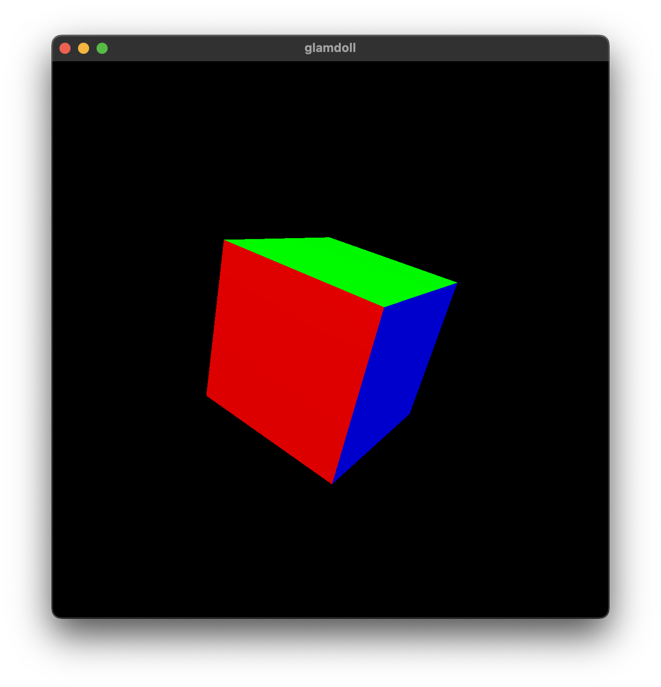

# glamdoll

**glamdoll** is a C++ OpenGL starter project based on Joey de Vries' source code
at [LearnOpenGL.com](https://learnopengl.com/) and Dr. Mike Bailey's project
sample for [CS 450](https://web.engr.oregonstate.edu/~mjb/cs550/) at Oregon
State University.

<p align="center" style="max-width: 400px">
  
</p>

## Dependencies

Dependencies are managed by CMake's `FetchContent` module, which retrieves the
external source code and builds the required files and libraries automatically.

| Dependency                              | Description                                                                                                                        |
| --------------------------------------- | ---------------------------------------------------------------------------------------------------------------------------------- |
| [glad](https://github.com/Dav1dde/glad) | OpenGL function loader (Note: this project imports the `c` branch which contains the pre-built C-language loader and header files) |
| [glfw](https://github.com/glfw/glfw)    | Window/context management and input/event handling                                                                                 |
| [glm](https://github.com/g-truc/glm)    | Header-only vector mathematics and matrix transformations library                                                                  |

## Getting started

### Windows (Visual Studio)

1. Clone repository.

    ```sh
    git clone https://github.com/mattmuroya/glamdoll.git
    ```

2. Open project folder in Visual Studio.

3. Build project.

    ```
    Build > Build All
    ```

4. Run executable.

    ```
    Debug > Run Without Debugging
    ```

### Mac (command line)

1. Clone repository.

    ```sh
    git clone https://github.com/mattmuroya/glamdoll.git
    ```

2. Create and move to `build` directory.

    ```sh
    mkdir build
    cd build
    ```

3. Generate Makefile.

    ```sh
    cmake ..
    ```

4. Build project.

    ```sh
    make
    ```

5. Run executable.

    ```sh
    ./glamdoll
    ```
